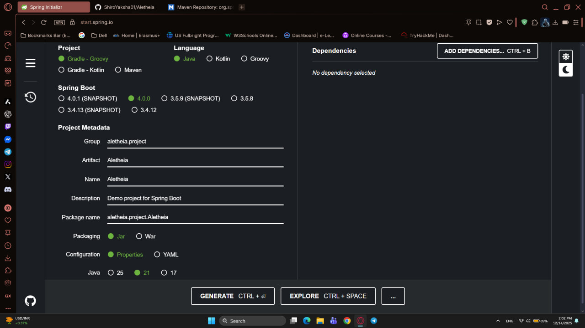
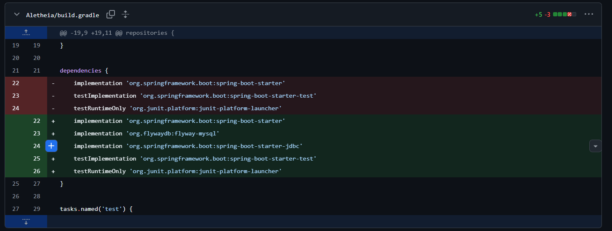
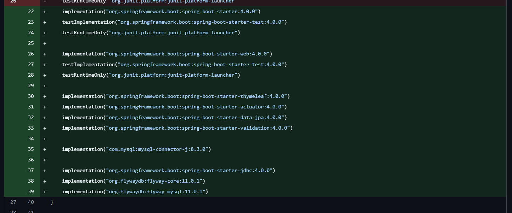

# Week 1 Report

<p>This week which is week 1 of the project we have finished setup our project and create tables for our database. </p>

Week 1 progress:

1. Commits on Dec 8, 2025
   - Setha:
       - Creating a github repo with only README.md file


2. Commits on Dec 14, 2025

   - Setha:
       - Setup the project. 
       - The original plan is to set up the project folder and the report folder in separate folders.
       - Approve the pull request from Kimheng


3. Commits on Dec 15, 2025
   - Phayuk:
       - Change Java version from 21 to 25
       - Changing the project folder structure in github from separate project and report folders to report folder inside project folder instead.
       - Config DB. 
       - Adding mysql database for migration inside "application.properties".
       - Creating database tables in "Aletheia/src/main/resources/db/migration/V1__first_db_design.sql".
   - Kimheng: 
       - Add and configure the dependencies for db by using ```spring.jpa.hibernate.ddl-auto=none  #JPA/Hibernate configuration - disable auto-schema creation since we're using Flyway```
       - Fix the gradle build able to work for all members 
   - Setha:
       - Adding "Report/Aletheia_Members_And_Roles" and "Report/Aletheia_Week1_Report.md" in the Report folder