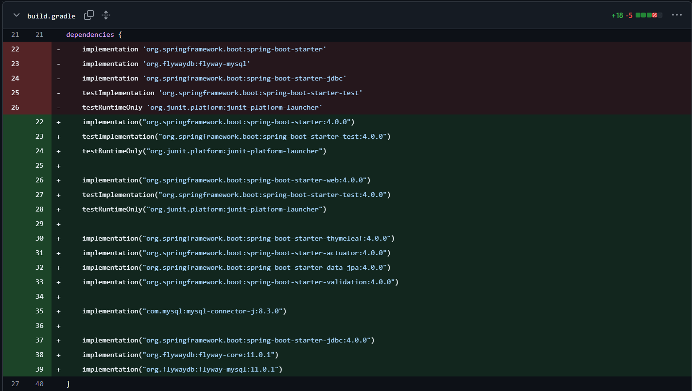
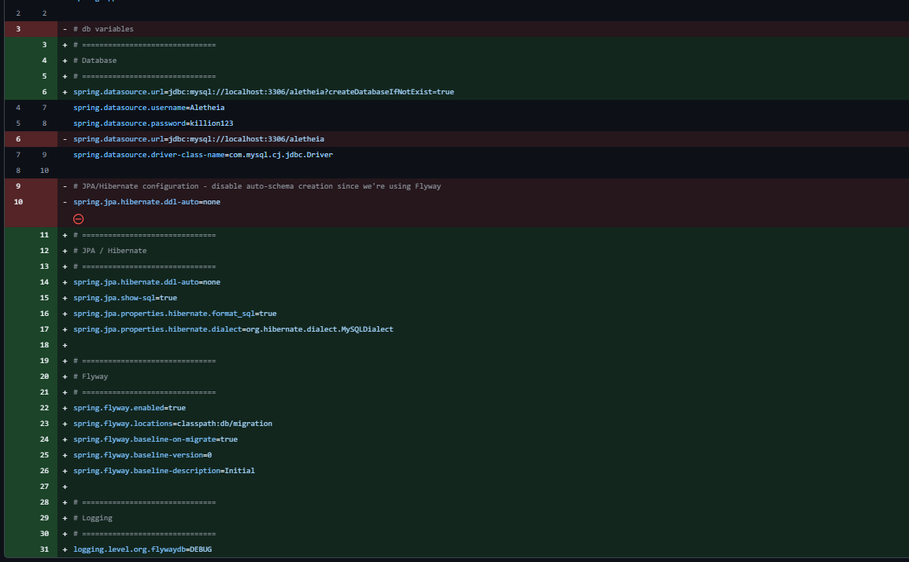
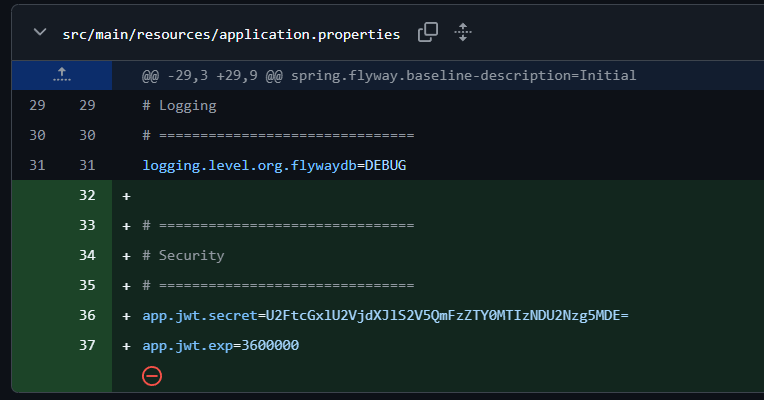

# Week 2 Report


1. Commits on Dec 15, 2025
   - Kimheng:
       - config build.gradle 


2. Commits on Dec 16, 2025
   - Kimheng:
       - Adding "FlywayConifg.java"
       - stop using ```spring.jpa.hibernate.ddl-auto=none``` and organize the `src/main/resources/application.properties` file into sections 
       - Changed some syntax inside `src/main/resources/db/migration/V1__first_db_design.sql` Example From \`user\` to users
    - Setha:
        - Accepting pull request to merge with main branch from Kimheng


3. Commits on Dec 17, 2025

   - Pheaktra:
       - Add security, Register and Login logic by using the concepts we learned from our TP lessons
       - Adding springboot security and jwt dependencies in `build.gradle`
       - The files created are:
           - AuthRepsonse.java
           - AuthenticationController.java
           - CorsConfig.java
           - CustomUserDetailsService.java
           - JwtFilter.java
           - JwtProperties.java
           - JwtUtil.java
           - LoginRequest.java
           - LoginResponse.java
           - SecurityConfig.java
           - UserEntity.java
           - UserRepository.java
       - Adding security properties 


4. Commits on Dec 18, 2025

   - Kity:
       - organize the src folders structure from everything inside the `src/main/java/aletheia/project/Aletheia/` folder into multiple folders for thier specific purposes, like config folder, controller folder, dto folder, etc.
       - Creating `WebContoller.java` and UI for "dashboard", "login", and "signup" pages.
   - Setha: 
       - Accepting pull request to merge from Pheaktra.
       - Editing README.md file to show the project objectives.
       - Editing `Report/Aletheia_Week1_Report.md` to show week 1 progress in simple sentences.
       - Accepting pull request to merge from Kity (He accidentally delete the report folder because he thought it might be the causes for build error).
       - Adding Report folders back alongside week2 report
   - Phayuk:
       - created repositories
       - created entities
       - drafted controller (no logic yet)