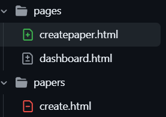
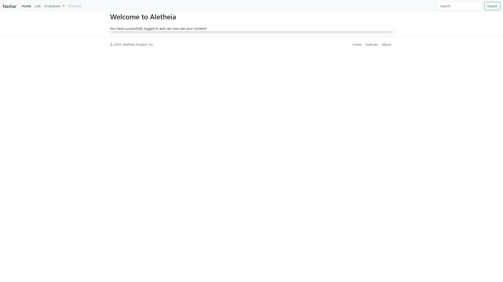
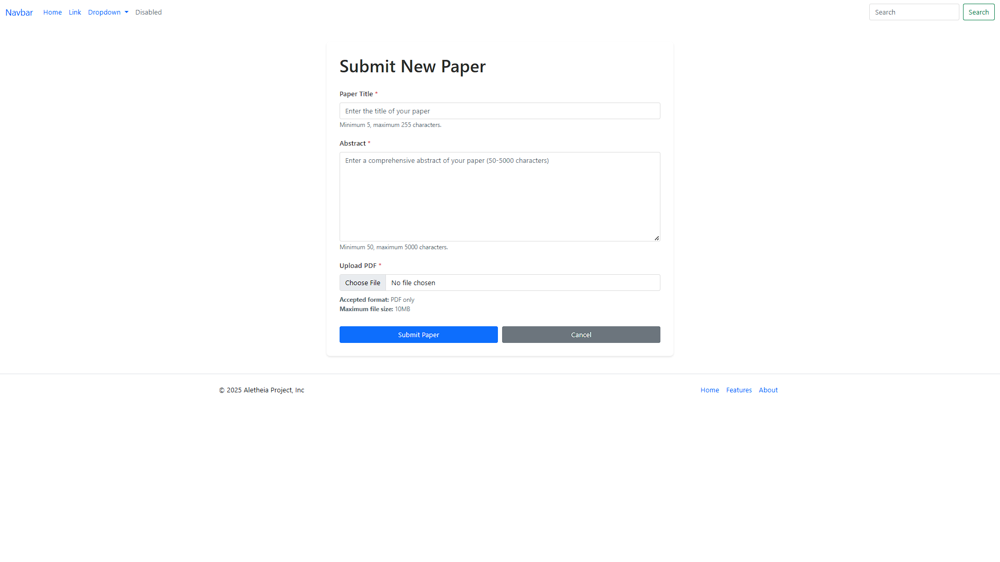
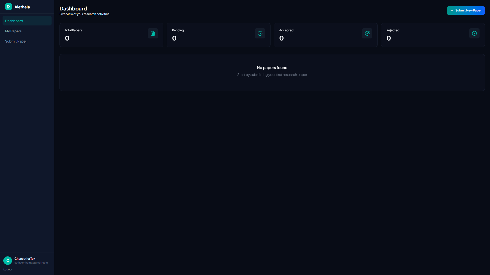
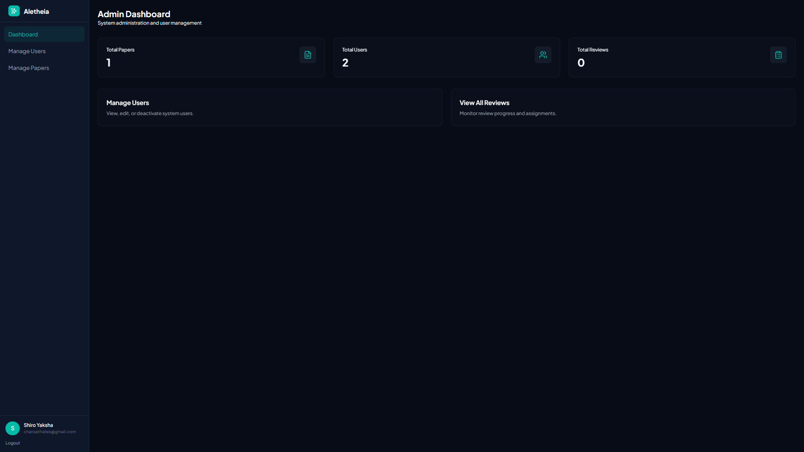

# Week 3 Report

## 1. Commits on Dec 26, 2025

### - **Kity:**
- Moving createpaper page from "papers" folder to "pages" folder 
- Restructuring so that all pages are created inside pages folder only.
- Changing and polish the UI of the website inside "fragments" folder
- Before:  
- After:  

## 2. Commits on Dec 27, 2025
### - **Setha:**
- Approved merging request from Kity.

### - **Pheaktra:**
- improve manage cookie(clear cookie), check login
- before this change the /login page always rendered the login view.
- After the change the controller first looks for a "jwt" cookie, tries to validate the JWT, and if the token is valid it redirects the user to /dashboard instead of rendering the login page. If there's no cookie or the token is invalid, it falls through and renders the login page as before.
- What changed in login/cookie handling:
    - **Previously:** /login always showed the login page.
    - **Now:** /login will automatically redirect logged-in users (as determined by a valid JWT cookie) to /dashboard. The presence of a valid cookie means the controller treats the user as authenticated for the purpose of redirecting away from the login page.
    - The JWT is read from a cookie named "jwt" rather than (for example) a header.

## 3. Commits on Dec 28, 2025

### - **Setha:**
- Approved mergin request from Pheaktra

## 4. Commits on Dec 29, 2025

### - **Kity:**
- Commenting a code block in SecurityConfig.java where **it redirects to /login if the user is not authenticated** to check for bug and then uncomment it.
- Fixed PaperController.java

    - **Where the error was:**
      - In PaperController.createPaper() — the code previously did:
        - `UserEntity author = new UserEntity();`
        - `author.setEmail(userDetails.getUsername());`
      - That created a new transient UserEntity (not the DB-managed user), which can cause persistence/lookup problems when passing the author to the service.
        
    - **How it was fixed:**
      - Added a UserRepository field and constructor parameter to the controller.
      - Replaced the transient creation with a DB lookup:
        - `String email = userDetails.getUsername();`
        - `UserEntity author = userRepository.findByEmail(email).orElseThrow(() -> new RuntimeException(...));`
      - This ensures the controller passes the actual, managed UserEntity from the database to paperService.
        
    - **Other related fixes in the commit:**
      - Added a null-check redirect when `userDetails == null (require login).`
      - Made file MIME-type check null-safe and used `bindingResult.reject(...) (global error)` because 'file' is not in the DTO.
      - Enforced file size limit and adjusted error view names `(papers/create -> pages/createpaper)`.
      - Added `e.printStackTrace()` for debugging in the catch block.

    - These changes correct the root cause (using a non-managed UserEntity) and improve validation/error handling.
    - Creating new page for review list.

### - **Setha:**
- Accepted Merge Pull Request from Kity with above commit.

### - **New Kity Commit:**
- Currently known **bug** is that Researcher cannot go into submit page to submit their paper with the new UI yet.
- Altering table papers in database to add new attributes 
    ``` sql
    ALTER TABLE papers ADD COLUMN status VARCHAR(20) DEFAULT 'PENDING';

    ALTER TABLE papers ADD COLUMN research_area VARCHAR(100) DEFAULT 'GENERAL';

    ALTER TABLE papers ADD COLUMN keywords VARCHAR(255) DEFAULT 'NONE';
    ```
- Deleting footer and navbar fragments and create ui.html instead to replace the two fragments
- Change the name of `papercard.html` to `paper-card.html`
- Create new `submit.html` page to replace `create.html` for researcher to submit their paper
- Create a **"GlobalControllerAdvice"** that runs before every controller call and adds the currently authenticated user to the MVC model.
- Separate dashboard page for each roles instead of one unified dashboard page.
- Changing login and signup page UI
- Changes in `PaperService.java`
    - The controller now depends on **UserRepository** and **PaperRepository** and on **Spring Security Principal** to identify the current user.
    - `userRepository.findByEmail(...).orElseThrow()` will throw if no user is found — consider handling that case gracefully.
    - The code assumes `paperRepository.findByAuthorId(...)` exists and that **"PaperEntity"** has a `getStatus()` used for counting.
- Added new fields to the DTO and added corresponding getter and setter methods in `PaperRequest.java` and `RegisterRequest.java`
- Key changes in commit **"dynamic dashboard"**: 
    - Authentication flow: login/register page logic moved and hardened (JWT check moved into AuthenticationController).
    - Paper management: added status/research area to PaperEntity, server-side search/filtering, new “My Papers” UI and paper card fragment.
    - Global model: unified attributes (currentPath + role flags) for consistent Thymeleaf conditionals/navigation.
    - Minor service/repository additions and a few template updates.
      

