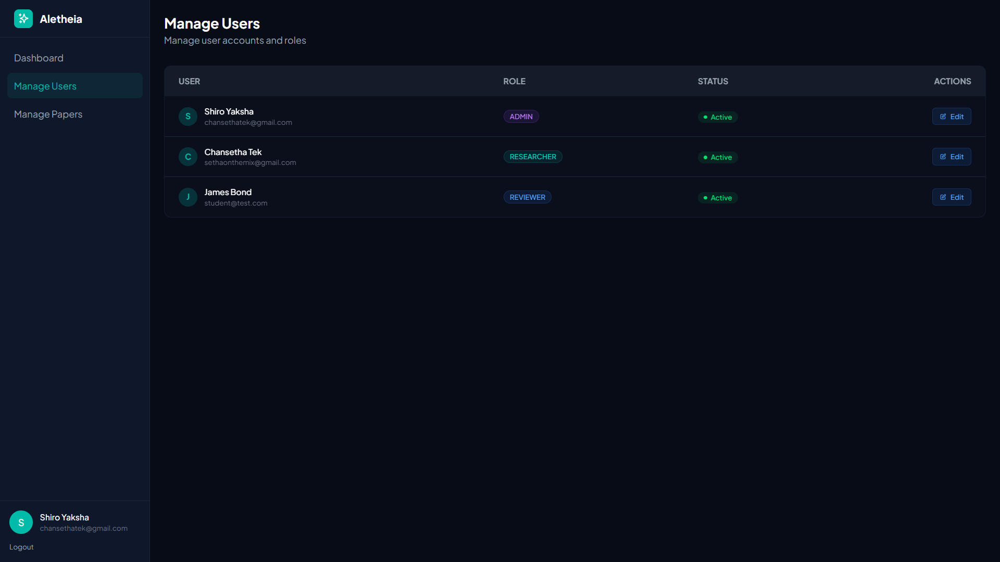
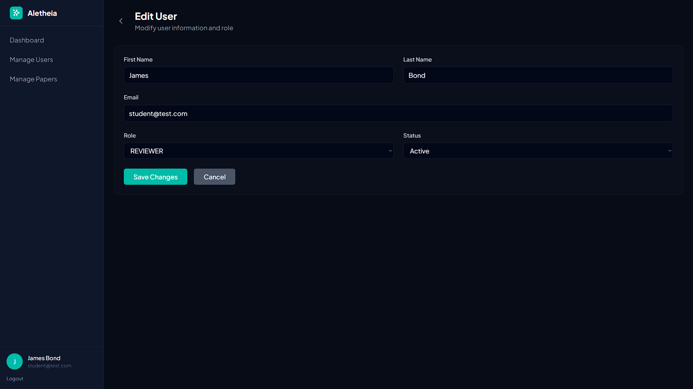

# Week 4 Report

## 1. Commits on Dec 30, 2025

### **Kity:**
- PaperController:
  - Added imports and a new @Value uploadDir property.
  - Added GET /papers/{id} handler to render paper detail page and set isAuthor flag.
  - Added GET /papers/files/{filename} endpoint that serves PDF files (returns ResponseEntity<Resource>, sets Content-Type and Content-Disposition).
  - Minor view-model additions (pageTitle, pageSubtitle).
  - Other wiring and small code insertions related to file serving and detail viewing.

- PaperEntity:
  - Added a new column/field: keywords (with getter/setter).

- PaperService:
  - Added Optional<PaperEntity> findById(Long id).
  - added Optional import.

- Templates / UI
    - Added `papers/detail.html`:
      - New Thymeleaf page for paper details (includes download link, actions, keywords, metadata, reviews placeholder).

    - Deleting the whole `createpaper.html`
    - Modified `fragments/paper-card.html`:
      - Changed author display to use firstName and lastName (th:text changed).

    - Modified `fragments/sidebar.html`:
      - Adjusted `th:if/links to use absolute-style paths (/@{...})` and `currentPath checks (added leading slashes)`.
      - Normalizing the currentPath checks to include the leading slash ensures the active-class condition matches whatever value the controller/template sets (likely includes a leading slash), so the correct sidebar item is highlighted.


### **Setha:**
- Accepted Merged Pull Request from **Kity**.
- Known bug from Kity: `There is still a bug where you cannot fetch the paper`.


## 2. Commits on Jan 1, 2026

### **Kity:**   

- #### Backend – Core Logic Updates
  - Role-Based Dashboards & Routing
    - WebController.java now routes users to different dashboards based on their roles (ADMIN, REVIEWER, RESEARCHER).
    - Added two new dashboards: one for admins and one for reviewers.


  - Admin Features
    - Major expansion of AdminController.java:
      - Dashboard for admins.
      - User management (list/system view).
      - Assign/unassign reviewers to/from papers.
      - Reviewer assignment logic improved:
        - Filtering available reviewers.
        - Workload calculation.
        - Avoids assigning reviewers to their own papers or to papers they've already been assigned.
      - Constructor-based dependency injection.


  - Review System Update
    - ReviewEntity.java and corresponding SQL migration:
    - New fields: status (for PENDING, IN_PROGRESS, etc.), deadline, createdAt, feedback (renamed from comment), and nullable score/submittedDate.
    - New lifecycle hooks and helper (e.g., getDaysLeft()).
    - Matches SQL migration (V3__alter_table_review.sql) to update DB schema.
    - **ReviewRepository.java:** Added helper to count active (not completed) reviews for reviewer workload display.


  - User Management
    - UserEntity.java: New getFullName() utility.
    - UserRepository.java: Find users by role added.


- Frontend – New and Updated Pages
  - New Dashboard Pages
    - `src/main/resources/templates/dashboard/admin.html` – Admin dashboard
    - `src/main/resources/templates/dashboard/reviewer.html` – Reviewer dashboard


  - Admin User Management UI
    - `src/main/resources/templates/admin/users.html` – System-facing user management table for admins.


  - Sidebar Improvements
    - **Fragments/sidebar.html** updated to add new admin navigation shortcuts for managing users and papers.


- Migration and Housekeeping
  - Database Migration
    - V3__alter_table_review.sql: Updates reviews table for new fields, changes, and renaming.
        ```sql
        ALTER TABLE reviews 
        ADD COLUMN status VARCHAR(50) NOT NULL DEFAULT 'PENDING';

        ALTER TABLE reviews 
        ADD COLUMN deadline DATE;

        ALTER TABLE reviews 
        MODIFY COLUMN score DECIMAL(5,2) NULL;

        ALTER TABLE reviews 
        MODIFY COLUMN submitted_date TIMESTAMP NULL;

        ALTER TABLE reviews 
        ADD COLUMN created_at TIMESTAMP DEFAULT CURRENT_TIMESTAMP;

        ALTER TABLE reviews 
        CHANGE COLUMN comment feedback TEXT;
        ``` 


## 3. Commits on Jan 2, 2026
### **Kity:**
- Review functionality (new + controller/service wiring)
  - Added a full `"ReviewController"` `(endpoints: /reviews/my-reviews, /reviews/submit/{id}, GET form /submit/{id}, filtering, security checks, review submit flow)`. Handles reviewer listing, form display, submit with score/feedback and sets review status to COMPLETED.
  - Wired ReviewRepository into `PaperController`, `WebController`, `PaperService` and other controllers to fetch reviews and counts.
  - **PaperService:** new `updatePaperStatusBasedOnReviews(paperId)` — loads reviews, computes average score, sets paper status to ACCEPTED/REJECTED when all reviews are COMPLETED (threshold example: >= 3.0).
  - **PaperController:** now loads reviews for a paper, exposes isAuthor and canViewReviews flags for the view.

- Admin / paper management
  - **AdminController:** added `/admin/papers` endpoint with search + status filters and model attributes for admin papers view.
  - **New admin templates:** `admin/papers.html` and `admin/assign-reviewer.html` to support listing papers, filtering, and assigning/unassigning reviewers.
  - **build.gradle:** added thymeleaf-layout-dialect dependency.

- Reviewer UX / pages
  - Added reviewer views: `reviewers/assigned-paper.html`, `reviewers/my-reviews.html`, rev`iewers/submit.html` — full UI for assigned papers, reviewer dashboard, and review submission.
  - Updated paper detail template to show peer reviews conditionally (`canViewReviews`) and added actions (`assigners/download/edit`) with admin checks.


- UI / layout / fragments
  - `layout/index.html`: added lucide icons script and createIcons invocation.
  - `fragments/sidebar.html`: updated navigation links (assigned reviews, manage papers) and active-state classing.
  - `fragments/ui.html`: small icon attribute change (data-lucide).
  - Removed/refactored older **"templates/fragments"** (`pages/dashboard.html`, `pages/reviewlist.html` and a `"statscard fragment"` were removed/replaced).


- Misc / wiring & metadata
  - **WebController:** includes totalPapers, totalUsers, totalReviews in admin dashboard model.
  - Many controllers and services updated to inject ReviewRepository / UserRepository / PaperService where needed.
  - Several template improvements (status badges, cards, filters, deadline UI, download links, author/role checks).

- **Overall summary:**
    This commit completes the reviewer assignment and review workflow across backend and frontend. It implements a ReviewController and review-related service logic (including computing average review scores and auto-updating paper status), wires ReviewRepository through controllers/services, adds admin and reviewer UI pages for assigning and submitting reviews, improves paper detail and dashboard displays (includes review counts), and updates templates/fragments/layout (including adding lucide icons and thymeleaf layout dialect).


### **Setha:**   
- Accepting Merge Request from Kity with the above commits
  - Note: still missing Edit & Delete features for all of the 3 roles.

## 4. Commits on Jan 4, 2026
### **Pheaktra:**
- Enables researchers to edit their submitted papers by adding edit functionality to the paper management system. The implementation reuses the existing submit form template for both creating and editing papers.

- Key Changes:
  - Added edit endpoints (GET and POST) in PaperController to handle paper editing
  - Extended PaperRequest DTO with fileName property to display current file in edit mode
  - Updated submit.html template to support both create and edit modes with conditional rendering

- Affected files:
  - `PaperController.java`
  - `PaperRequest.java`
  - `PaperService.java`
  - `dashboard/researcher.html`
  - `papers/detail.html`
  - `papers/submit.html`


### **Kimheng:**
Enhance Paper Submission Form & Add Review Features
- **Summary:** Redesigned paper submission form with validation, added paper withdrawal feature, enhanced paper card with review ratings, and improved dashboard UI.

  - Debug paper CRUD and fix controller issues
    - Add extensive console logging to createPaper() method
    - Fix @PathVariable("filename") parameter annotation
    - Fix model attributes in error handlers (editMode, paperRequest)
    - Ensure form data persists on validation errors
  
  - Redesign paper submission form with improved UX and validation
    - Implement two-column layout: form info on left, file upload on right
    - Add toggleable alert messages (auto-close after 3 seconds)
    - Add real-time validation indicators with asterisks (*) and checkmarks (✓)
    - Implement field-level validation on user input
    - Add dynamic visual feedback: * shows incomplete, ✓ shows valid
    - Add character counter for abstract with color-coded feedback
    - Improve form styling with better spacing and hover effects
    - Add client-side validation with focus management
    - Implement drag-and-drop file upload with validation
    - Add file size (10MB) and type (PDF only) validation
    - Support create and edit modes with appropriate labels
    - Fix label accessibility with proper for/id attributes

- **Files Changed:**
  - `PaperController.java`
  - `PaperService.java`
  - `submit.html`
  - `paper-card.html`
  - `researcher.html`


## 5. Commits on Jan 5, 2026

### **Phayuk:**
- File Changes:
  - `AdminController.java`
  - `users.html`
  - `edit-uer.html` (new file)
- New Feature:
  - Inside role admin account, when admin manage user, user able to edit user information  
  - In edit user page 

### **Setha:**
- Accept Merging Pull Request from Kimheng, Pheaktra, and Phayuk.
- Writing Progress report week 3 and week 4
- Editing Progress report week 1 and week 4