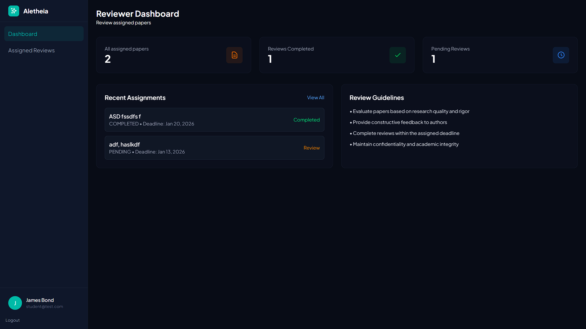
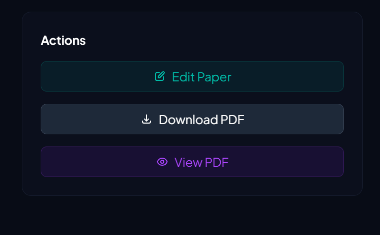
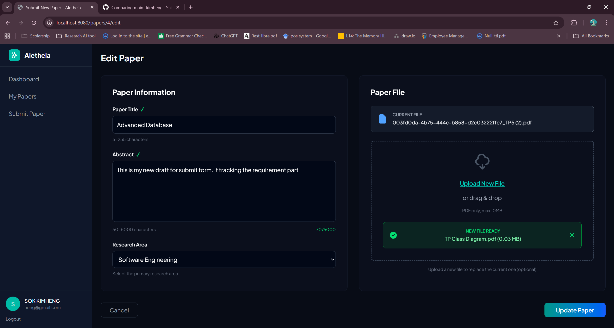
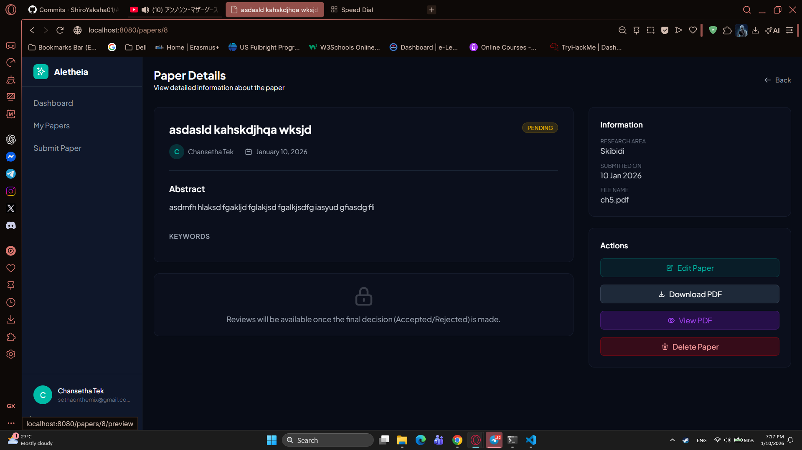
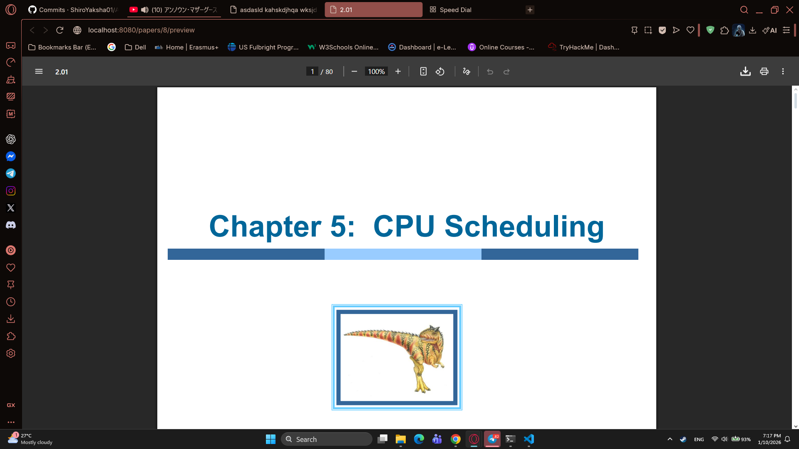

# Week 4 Report

## 1. Commits on Jan 8, 2026

### **Kimheng:**

- adding param in build.gradle

    ```gradle
    tasks.named('compileJava') {
        options.compilerArgs.add('-parameters')
    }
    ```
    It tells the Java compiler to store method and constructor parameter names in the compiled class files so frameworks and reflection can access them at runtime.

- Changing AdminController, PaperController, and ReviewerController to have `value = "Search"` and `value = "status"` at `@RequestParam` **String Search** an **String status**


## 2. Commits on Jan 9, 2026

### **Pheaktra:**
- In PaperController: change `@PathVariable("id")` to `@PathVariable Long id`
- Reformat code in my-reviews.html, and edit Review button, visible only if review is COMPLETED
- prepare submit.html for edit section
- add edit the review to **review controller** so reviewer can edit what they has reviewed
- add `detail-review` page and add route **view review detail** in `ReviewController`
- fix logic on back, cancel btn, after submit review and after edit review and fix routing of submit new paper on my-paper.html
- fix back arrow logic (doesn't work, still return to dashboard)


### **Setha:**
- Accepted all merge pull request from Pheaktra


## 3. Commits on Jan 10, 2026

### **Phayuk:**
- User can edit their profile (the background is white)
- add `ProfileController.java`, `edit.html` files, and edit `fragments/sidebar.html` file
- fixed reviewer dashboard for reviwer dashbaord to show the number 

    

- removed `AssignmentController` since we not using it
- changed edit profile ui to have dark backgorund matching the rest of the pages
- fix edit profile for admin to see admin role option too

### **Kity:**

- complete delete paper feaeture in manage paper for admin
- fix bug delete on researcher where the researcher is not able to delete their own paper


### **Pheaktra:**

- validate deadline date and fix back arrow logic on detail-review.html


### **Kimheng:**

- add feature view in the details page and update the the file edit formed

    feature preview pdf
    
    update edit file form
    

- fix bug: no need to upload new file for edit form/paper
- improve paper edit and review pdf handling
  - Add PDF preview and download with original filenames for reviewers
  - Improve file security checks in review endpoints
  - Improve back and cancel button route for researcher side
  - add feature preview pdf on the reviewer side
- New paper details:

    
    preview file
    

    download pdf file
    
